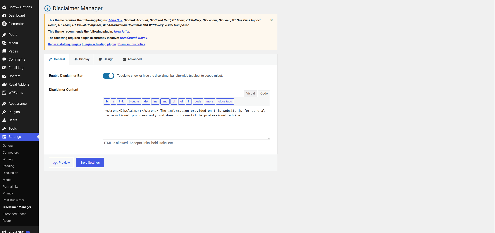

# Evolnux Disclaimer Bar

A lightweight WordPress plugin for displaying a configurable disclaimer bar on the frontend of a site. The bar can be positioned in common theme locations, restricted to specific content, styled from the WordPress admin, and optionally dismissed by visitors.

## Features

- Enable or disable the disclaimer bar from the WordPress dashboard.
- Edit disclaimer content with the built-in WordPress editor.
- Render the bar above the header, below the header, above the footer, fixed at the top, fixed at the bottom, or on a custom WordPress action hook.
- Display site-wide, on the homepage, selected pages, selected posts, or selected public post types.
- Exclude selected pages even when the bar is enabled site-wide.
- Configure responsive visibility for desktop, mobile, or both.
- Customize colors, typography, spacing, border, opacity, width, animation, and z-index.
- Let visitors dismiss the bar with cookie, localStorage, or sessionStorage persistence.
- Preview the bar from the settings screen before saving changes.
- Clean uninstall support through `uninstall.php`.

## Requirements

- WordPress 5.6 or newer.
- PHP 7.4 or newer.
- A theme that calls standard WordPress hooks such as `wp_body_open` and `wp_footer`.

The plugin includes its own PHP, CSS, and JavaScript files. It does not require Composer, npm, or a build step.

## Installation

1. Copy the `evolnux-disclaimer-bar` folder into `wp-content/plugins/`.
2. In WordPress admin, go to **Plugins**.
3. Activate **Evolnux Disclaimer Bar**.
4. Go to **Settings > Disclaimer Manager**.
5. Enable the bar, configure the content and display options, then save.

## Settings Overview

### General

- **Enable Disclaimer Bar**: Turns frontend output on or off.
- **Disclaimer Content**: Rich text content for the bar. WordPress-safe HTML is allowed.

## Admin Settings



## Top Bar Disclaimer


### Display

- **Position**:
  - `Top Bar`: Outputs near the start of the page.
  - `Below Header`: Outputs near the start of the page and repositions after the detected header.
  - `Above Footer`: Outputs before footer content.
  - `Fixed Bottom Bar`: Pins the disclaimer to the bottom of the viewport.
  - `Fixed Top Bar`: Pins the disclaimer to the top of the viewport.
  - `Custom Action Hook`: Outputs on a custom WordPress action hook.
- **Display Scope**:
  - Entire website.
  - Homepage only.
  - Selected pages.
  - Selected posts.
  - Selected post types.
- **Exclude Pages**: Prevents the bar from appearing on selected pages.
- **Responsive Visibility**: Controls whether the bar appears on desktop, mobile, or both.

### Design

- Background, text, and border colors.
- Border position and width.
- Font size, weight, alignment, and line height.
- Padding and margins.
- Full-width or boxed layout.
- Opacity.

### Advanced

- Dismissible close button.
- Custom dismiss button text.
- Dismiss expiry in days. A value of `0` makes dismissal session-only.
- Animation style.
- z-index for fixed positions and stacking control.

## Custom Hook Usage

When the position is set to **Custom Action Hook**, enter a hook name such as:

```php
wp_body_open
```

Then make sure your theme or another plugin fires that hook:

```php
do_action( 'wp_body_open' );
```

You can also use your own hook:

```php
do_action( 'my_theme_before_content' );
```

Then enter `my_theme_before_content` in the plugin settings.

## Dismissal Behavior

The frontend script stores dismissal state with the key `evolnux_dismissed`.

- If **Dismiss Expiry** is greater than `0`, dismissal is stored in a cookie and `localStorage`.
- If **Dismiss Expiry** is `0`, dismissal is stored in `sessionStorage` and resets when the browser session ends.

## File Structure

```text
evolnux-disclaimer-bar/
├── evolnux-disclaimer-bar.php
├── uninstall.php
├── includes/
│   ├── class-loader.php
│   ├── class-settings.php
│   └── helper-functions.php
├── admin/
│   ├── class-admin.php
│   ├── settings-page.php
│   └── assets/
│       ├── css/admin.css
│       └── js/admin.js
└── public/
    ├── class-frontend.php
    └── assets/
        ├── css/disclaimer-bar.css
        └── js/disclaimer-bar.js
```

## Key Implementation Notes

- `evolnux-disclaimer-bar.php` defines plugin metadata, constants, dependencies, boot logic, and activation defaults.
- `EVOLNUX_Settings` owns defaults, option reads, and sanitization.
- `EVOLNUX_Admin` registers the settings page, assets, WordPress Settings API option, and AJAX preview.
- `EVOLNUX_Frontend` checks whether the bar should display, enqueues public assets, and renders the bar at the selected location.
- `evolnux_should_display()` contains display-scope logic.
- `evolnux_build_inline_style()` builds the frontend and preview inline style string from sanitized settings.
- `uninstall.php` deletes the `evolnux_settings` option when the plugin is uninstalled.

## WordPress Option

All plugin settings are stored in one serialized option:

```text
evolnux_settings
```

The option is created on activation if it does not already exist.

## Development

There is no compile step for this plugin. Edit the PHP, CSS, and JavaScript files directly.

Recommended local workflow:

1. Install WordPress locally.
2. Place this folder in `wp-content/plugins/evolnux-disclaimer-bar`.
3. Activate the plugin.
4. Configure it from **Settings > Disclaimer Manager**.
5. Test positions and display scope on the frontend.

Before release, verify:

- The plugin activates without PHP warnings.
- Saving settings preserves expected values.
- The bar appears only on the configured scope.
- Dismissal works for both expiring and session-only modes.
- Fixed top and fixed bottom positions do not hide important theme content.
- Uninstall removes the `evolnux_settings` option.

## Security

- Direct file access is blocked with `ABSPATH` checks.
- Admin access is limited to users with `manage_options`.
- Settings are sanitized in `EVOLNUX_Settings::sanitize()`.
- Preview AJAX is protected by a nonce and capability check.
- Output content is escaped or filtered with WordPress escaping helpers.

## License

GPL-2.0. See the plugin header in `evolnux-disclaimer-bar.php` for license metadata.
